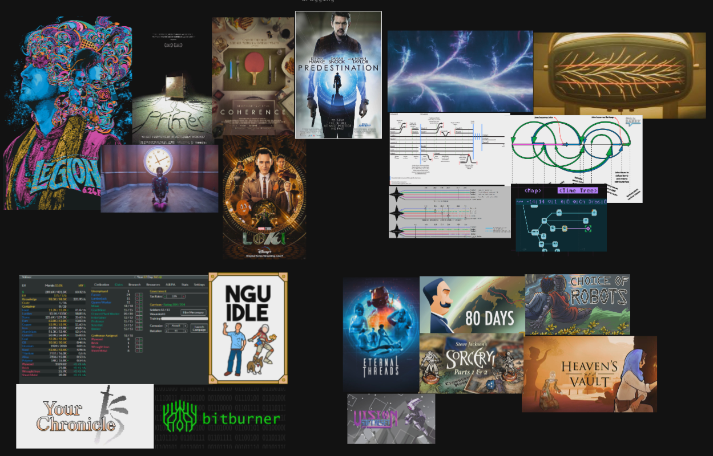
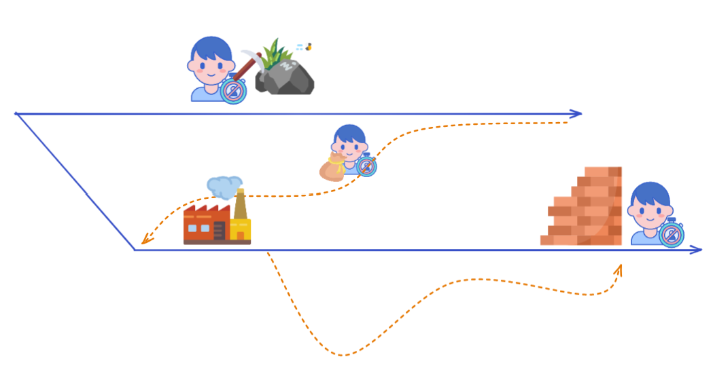
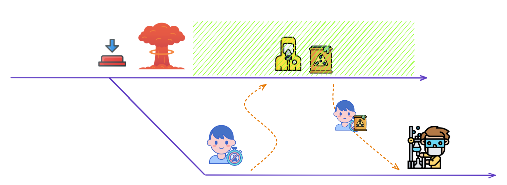
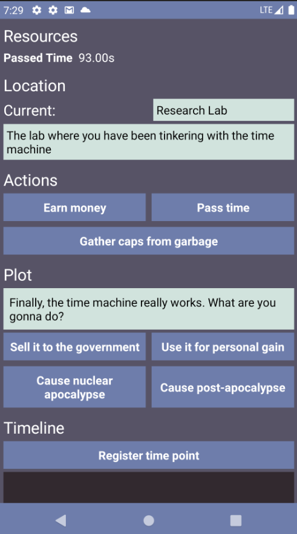
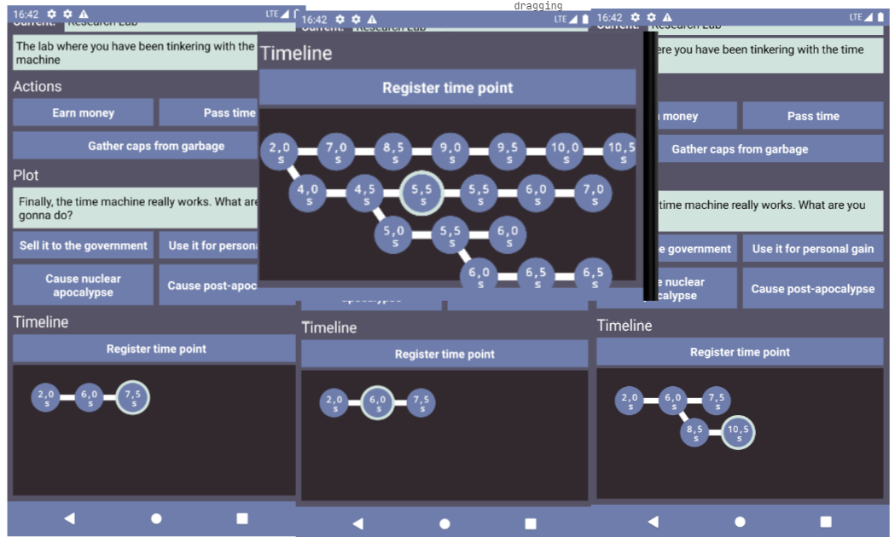
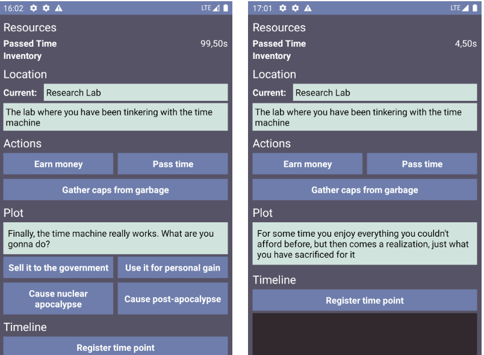
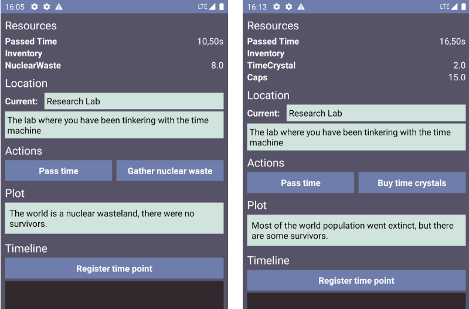

## Inspirations

Game's setting was inspired by various movies and show about time travel. Especially those where travelling back in time splits the timeline. Gameplay was inspired by idle and choose your own adventure genres.
Most of the idle games have a mechanic called prestige where the player resets their progress, but gets some reward for that. That reward in a form of perks or upgrades allows them to reach the same stage much quicker. And there is often what is called offline progress. The game calcualates how much you gained while the game had been closed.

## Gameplay
At first, I was going to create an ordinary idle game with time travel as setting, where prestige would be time travel to the past just in narrative. But then I thought, why don't I allow the player to time travel for real, both to the past and to the future. 
This was great source of inspiration because I haven't seen this done before. 

And at the same time I thought that I could implement it, because travelling to the past is basically saving and loading but with some things persisting. And travelling to the future is basically offline progress calculation that most of the idle games do.

There was a flood of ideas. For example, suppose there is a resource that you need to spend in order to time travel. You can accumulate the resource, travel to the past, build a factory, and get a lot of the resources. So there is a strategic element, which way to spend the time travel resource and what to do in order to make it more beneficial.

Or an idea that various timelines have advantages and disadvantages. For instance, there could be a timeline where the world had been destroyed by a nuclear apocalypse. You can gather some toxic waste materials there but you can't stay there for long.

## Prototype

So, in the prototype you can travel back in time, travel forward but only to the place where you have already been. Timelines have pros and cons. Plot and choices affect gameplay, gameplay affects plot and choices. We can earn resources.

### Time Travel

To travel in time you first press a button "Register time point", then you can always select that node and the game state will transition to the state of that time (beside things that persist through the time travel). If you travel back and make another choice, the timeline splits.

### Plot and Choices

There is a rudimentary system for plot and choices. Choices drive the plot and create modificators for the gameplay. There are two debug choices right now, one of them causes nuclear apocalypse, another causes post-apocalyspe like Fallout and Mad Max.

### Timelines

These timelines have their pros and cons. In nuclear apocalypse timeline you can gater nuclear waste. In post-apocalypse you can buy timetravel for caps. The idea was that you have something that is usually garbage, but in this timeline it's actually useful.